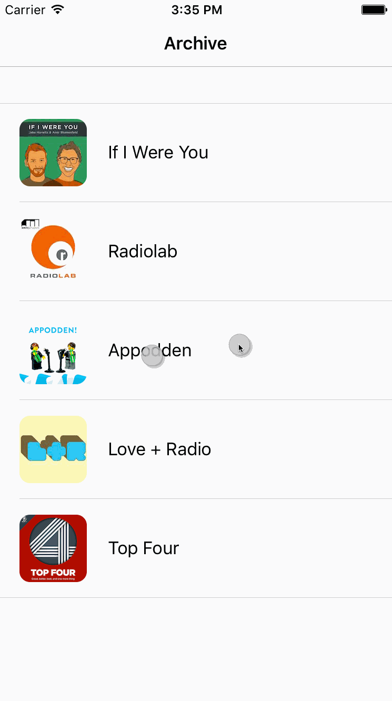

# NightModeTransition
This repository contains an implementation of a transition heavily inspired by 
the Night Mode transition in [Castro 2](http://supertop.co/castro/). You can see 
a glimpse of the transition near the end of 
[the trailer](http://supertop.co/castro/#trailer).

#### Running the application
Simply open `NightModeTransition.xcodeproj` in Xcode and Build & Run the 
application.  Swipe downwards with two fingers when running the application to 
transition between the two available styles.

#### How the transition works
The transition is implemented using snapshot views and masking views. When the
transition begins, a snapshot of the current view is taken and placed on top of
all other content. A masking view for the snapshot view is also created at this
point, initially letting the entire snapshot be seen. When this is done, the
actual view is updated to the new style.

As the user pans and the transition progresses, the masking view is moved to
let the user see the updated view behind the snapshot. When the panning ends
the masking view is animated either to its initial position if the transition
was cancelled, or to the bottom of the window if the transition was completed.
When the animating completes, the snapshot is removed from the view hierarchy
and the user can interact with the application as usual.

A more detailed write-up will be posted on [my blog](http://ndersson.me)
shortly.

#### Podcasts in the demo application
* [If I Were You](http://ifiwereyoushow.com)
* [Radiolab](http://radiolab.org)
* [Appodden](https://overcast.fm/itunes1005587579/appodden)
* [Love + Radio](http://loveandradio.org)
* [Top Four](https://www.relay.fm/topfour)
