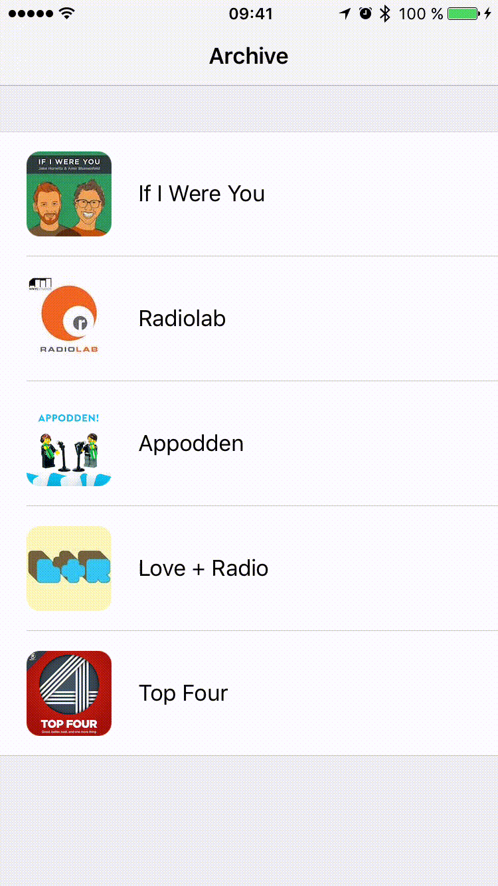

# NightModeTransition
This repository contains an implementation of a transition heavily inspired by 
the Night Mode transition in [Castro 2](http://supertop.co/castro/). You can see 
a glimpse of the transition near the end of 
[the trailer](http://supertop.co/castro/#trailer).

### Running the application
Simply open `NightModeTransition.xcodeproj` in Xcode 8 and Build & Run the 
application.  Swipe downwards with two fingers when running the application to 
transition between the two available styles.

**NOTE:** The application currently doesn't work as expected in the iPhone 7
simulator due to [an issue](https://forums.developer.apple.com/thread/63438)
with snapshot views. Please run the application in any other simulator, or on
a device.

### How the transition works

_Note: A more detailed write-up has been posted on 
[my blog](http://ndersson.me/post/recreating_the_castro_2_night_mode_transition/)._

The transition is implemented using a snapshot view and a mask layer. When the
transition begins, a snapshot of the current view is taken and placed on top of
all other content. A mask layer for the snapshot view is also created at this
point, initially letting the entire snapshot be seen. When this is done, the
actual view is updated to the new style.

As the user pans and the transition progresses, the mask layer is moved to
let the user see the updated view behind the snapshot. When the panning ends
the mask layer is animated either to its initial position if the transition
was cancelled, or to the bottom of the window if the transition was completed.
When the animating completes, the snapshot is removed from the view hierarchy
and the user can interact with the application as usual.

To achieve the bouncy effect of the transition, we use a `CAShapeLayer` as the
mask and update the path of the layer as the transition progresses. The top of
the mask is drawn using a quad curve 
(`UIBezierPath.addQuadCurveToPoint(_:controlPoint:)`) where the vertical 
position of the control point is based on the vertical velocity of the pan 
gesture. The faster the user pans, the more pronounced the curve will be. Since
the pan gesture recognizer calls its target selector periodically even when the 
user stops dragging (but keeps their fingers on the screen) as long as the
calculated velocity hasn't settled, we don't need to add any special code 
to return the mask to its non-curved state.

### Podcasts in the demo application
* [If I Were You](http://ifiwereyoushow.com)
* [Radiolab](http://radiolab.org)
* [Appodden](https://overcast.fm/itunes1005587579/appodden)
* [Love + Radio](http://loveandradio.org)
* [Top Four](https://www.relay.fm/topfour)
